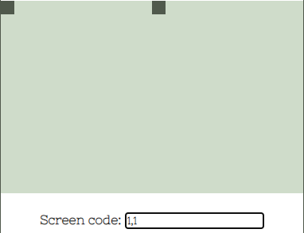
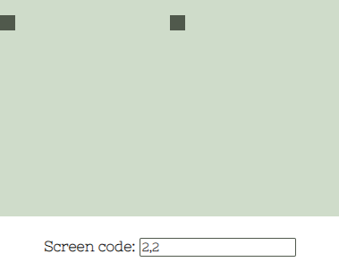
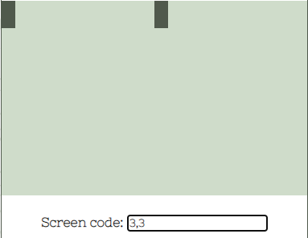
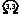
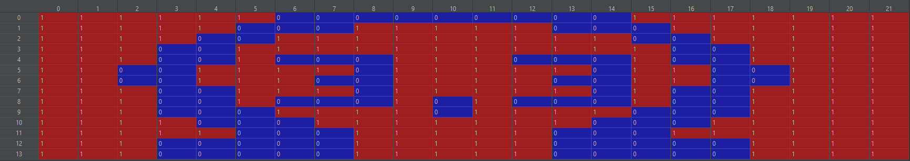
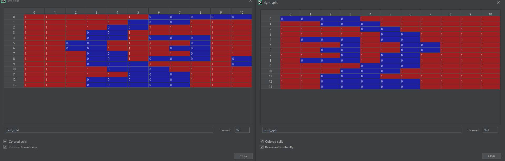
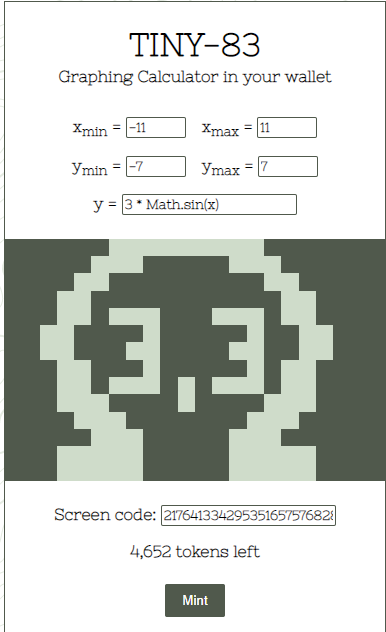
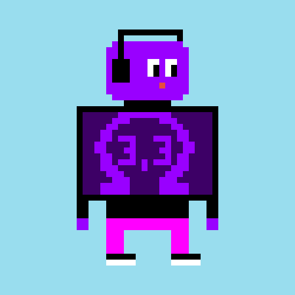

# Tiny-83 Image Converter

A small tool that converts 22x14 pixel bitmap images into seed values for minting [Tiny-83 NFTs](https://opensea.io/collection/tiny-83). Because apparently everything can be an NFT — including a calculator screen.

## What it does

Takes a tiny black-and-white BMP image (22x14 pixels, 1-bit color depth) and encodes it as two 256-bit integers. These integers serve as the left and right seed values for on-chain minting.

## How the encoding works

When you play around with the [minting page](https://tiny-83.github.io/tiny-83/), you'll notice the two seed values have a very distinctive influence on what shows up on screen:

<p align="center">
    <br>
    (1,1)
</p>
<p align="center">
    <br>
    (2,2)
</p>
<p align="center">
    <br>
    (3,3)
</p>

Notice something? That's binary. Both panes (left and right) are composed of 11x14 pixels — 154 pixels per pane, 308 for the whole image. What we need is a way to address each pixel individually.

### Step 1: Prepare the image

Take any image, resize it to 22x14, and save it as a 1-bit BMP. Here's the OHM logo I used as an example (displayed blurry because the browser upscales it — the original size is below):

<p align="center">
    <br>
    <br>
    OHM (3,3)
</p>

### Step 2: Convert to a binary matrix

```python
image = im.open(img_path)
image_array = np.array(image)
```

This gives us a two-dimensional array where each pixel is either 0 (black) or 1 (white):

<p align="center">
    <br>
    Matrix representation of our image
</p>

This matrix is our mask — like a sieve. Pour color through it and the canvas only gets painted where the sieve permits.

### Step 3: Split into left and right panes

```python
left_split, right_split = np.split(image_array, 2, axis=1)
```

<p align="center">
    <br>
    Left and right matrix
</p>

### Step 4: Build the address canvas

```python
slot_map_left = np.array([2 ** x for x in range(h * w)])
slot_map_right = np.array([2 ** x for x in range(h * w)])
```

This is the trick. Each pixel on both panes can be addressed via a `2 ** x` value. Top-left corner is `2 ** 0`, bottom-right is `2 ** 153`.

### Step 5: Apply mask and sum

```python
zip_left_slots = slot_map_left * left_split
zip_right_slots = slot_map_right * right_split

left = zip_left_slots.sum()
right = zip_right_slots.sum()
```

Multiply the address arrays by their masks, then sum. Because it's binary, summing the addresses is equivalent to a binary `AND`. We end up with two integers — the seeds.

Essentially: `seed = Σ(pixel[i] × 2^i)` for i = 0 to 153. Simple binary encoding that maps visual patterns to blockchain-compatible `uint256` values.

### Result

```
Left:   21764133429535165757682873043452904982125215743
Right:  22835963083295327415964576320725097856141869054
```

Enter them into the minting page:

<p align="center">
    <br>
    Minting preview
</p>

<p align="center">
    <br>
    The original OHM(3,3) calculator
</p>

## Usage

```bash
# Install dependencies
pip install numpy pillow

# Run the converter
python main.py
```

When prompted, enter the path to your BMP file. The script outputs two comma-separated integers ready to paste into the minting function.

## Image requirements

- **Size:** 22x14 pixels exactly
- **Color depth:** 1-bit (black and white only)
- **Format:** BMP
- [Paint.NET](https://www.getpaint.net/) works well for creating these

## Dependencies

- Python 3.6+
- NumPy
- Pillow (PIL)

## Context

Built during the NFT era of 2021. The Tiny-83 project renders pixel art on a virtual TI-83 calculator screen — on-chain. This tool converts your pixel art into the seed values needed to mint it. Two sample images (`frog.bmp`, `ohm.bmp`) are included if you want to try it out.
