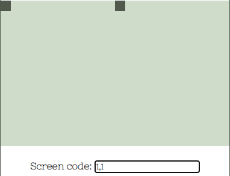
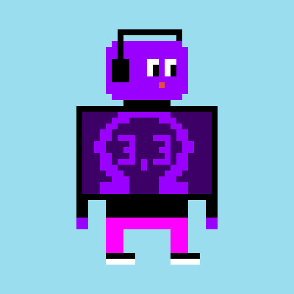

## What is this?
This tool allows you to convert any 14p high and 22p wide Bitmap (.bmp) to the seed needed for the 
[Tiny-83 NFT project](https://opensea.io/collection/tiny-83 "Tiny-83 NFT project").

Project Twitter: https://twitter.com/TINY83_nft

Project Open Sea: https://opensea.io/collection/tiny-83

Minting Page: https://tiny-83.github.io/tiny-83/


My Twitter: https://twitter.com/shib_maximalist

My Open Sea: https://opensea.io/shib_maximalist

## Usage
### Windows
```
git clone https://github.com/shib-maximalist/tiny_83_image_converter
cd tiny_83_image_converter
py -m pip install -r requirements.txt
py main.py
```

### Linux
```
git clone https://github.com/shib-maximalist/tiny_83_image_converter
cd tiny_83_image_converter
pip install -r requirements.txt
python main.py
```

## How does it work?
When I played arround with the [minting page](https://tiny-83.github.io/tiny-83/ "minting page")  
I noticed that the two seed value had a very distinctive influence on the outcome on the screen:
<p align="center">
    <br>
    (1,1)
</p>
<p align="center">
    <br>
    (2,2)
</p>
<p align="center">
    <br>
    (3,3)
</p>

Notice something? Thats binary! Both panes (left and right) are composed of 11x14 pixels. Thats 154 pixels per pane and 308 for the whole image.
What we need is a way to address the pixels individually.

Let's start with our Image:

I took the OHM logo, resized it and edited it to be a 14x22 bitmap. The Image is displayed blury because it's upscaled by a factor of 10 and your browser tries to fill in the gaps with filtering techniques that do not apply to pixel art. The original size pixture is below the big one.
<p align="center">
    <br>
    <br>
    Ohm (3,3)
</p>

We use these two lines to open the image and turn it into a matrix
```python
image = im.open(img_path)
image_array = np.array(image)
```

This matrix ist just a two-dimensional array that represents where a pixel is black (0) and where a pixel is white (1). We can use an IDE to visualize how it looks:
<p align="center">
    <br>
    Matrix representation of our image
</p>

This matrix gives us a mask which we can apply to the canvas (panes). Imagine it like a sieve. If we pour color on it the canvas will only get painted where the sieve permits it. But what *is* the canvas? The canvas consists of two panes called *left* and *right*. We currently have only one matrix so we have to split it in the middle:

```python
left_split, right_split = np.split(image_array, 2, axis=1)
```

<p align="center">
    <br>
    Left and Right Matrix
</p>

We did not answer the question what the canvas is. The canvas is this:

```python
slot_map_left = np.array([2 ** x for x in range(h*w)])
slot_map_right = np.array([2 ** x for x in range(h*w)])
```
This is the magic trick. Each pixel on the canvas (on both individual panes) can be addressed binary via a `2 ** x` address. 
The pixel in the top left corner has the address `2 ** 0`
The pixel in the bottom right corner has the address `2 ** 153`

The above commands generate two 1-dimensional arrays representing each pixel address per pane. All we have to do now is to multiply these address arrays with their masks:

```python
zip_left_slots = slot_map_left * left_split
zip_right_slots = slot_map_right * right_split
```
The resulting arrays only contain addresses for pixels that we ant to colour (actually it's the pixels we don't want to color but in the end it's the same).
The last step is to generate the single number seed from it:

```python
left = zip_left_slots.sum()
right = zip_right_slots.sum()
```

Why do we sum up the whole array? Because it's binary! Summing the binary addresses is the same as a binary `AND`. Awesome! We end up with:

```
Left:	21764133429535165757682873043452904982125215743 
Right:	22835963083295327415964576320725097856141869054
```

Let's enter them into the :

<p align="center">
    <br>
    Minting preview
</p>

*SUCCESS!*

I am the original creator of the OHM(3,3) Tiny Calculator. Every other one copied my seed. If you want the original you can get it [here]("https://opensea.io/assets/0x7deb38a22694608a58b28970320d39ee50e7bc0f/652")

<p align="center">
    <br>
    Minting preview
</p>

